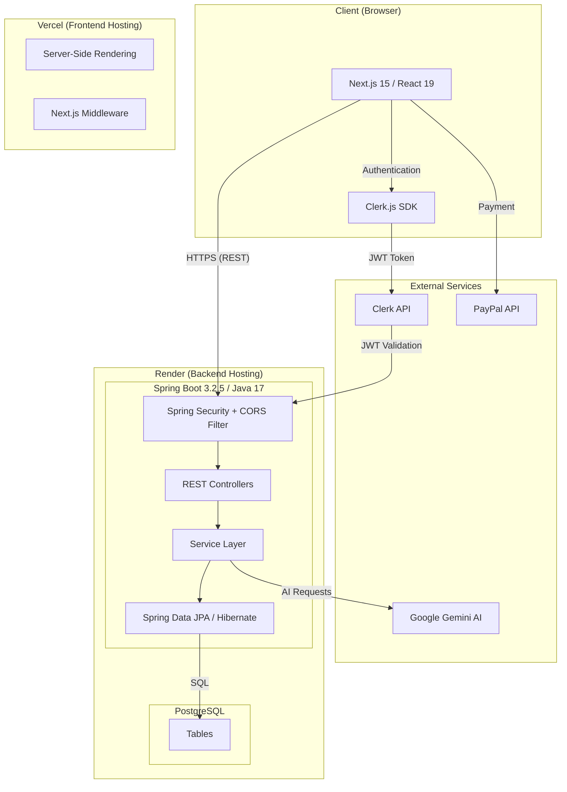
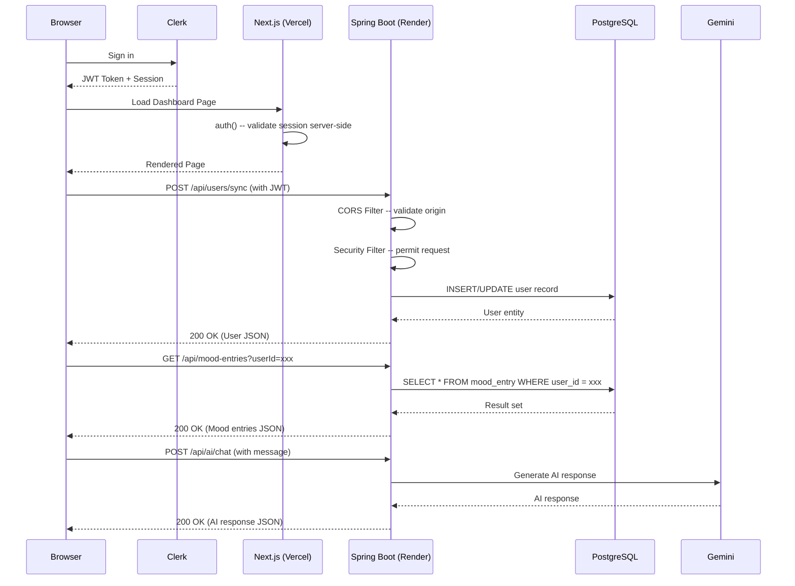
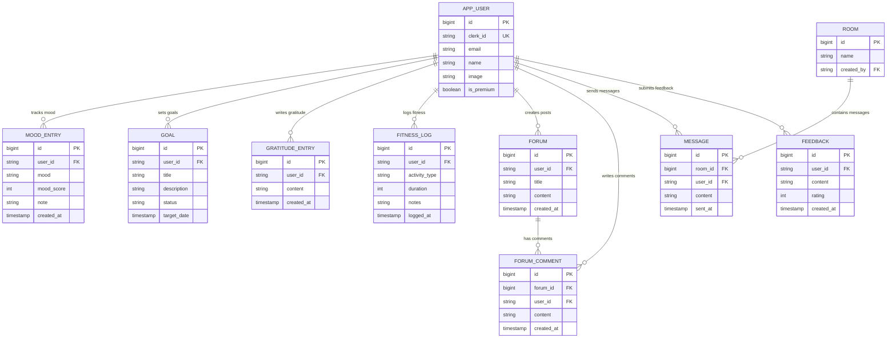
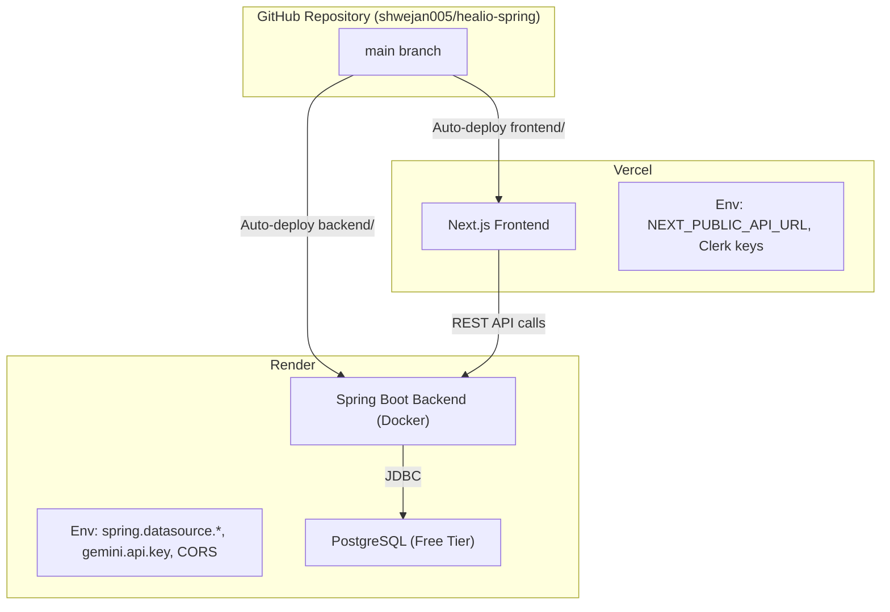
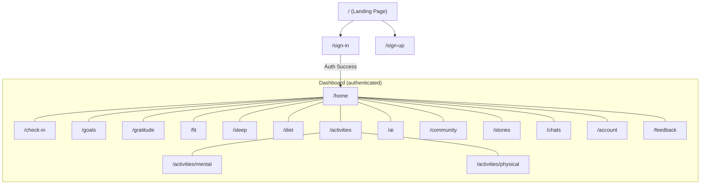

# Healio -- System Architecture

## System Overview

```mermaid
graph TB
    subgraph Client["Client (Browser)"]
        UI["Next.js 15 / React 19"]
        Clerk_FE["Clerk.js SDK"]
    end

    subgraph Vercel["Vercel (Frontend Hosting)"]
        SSR["Server-Side Rendering"]
        API_Routes["Next.js Middleware"]
    end

    subgraph External["External Services"]
        Clerk_API["Clerk API"]
        Gemini["Google Gemini AI"]
        PayPal["PayPal API"]
    end

    subgraph Render["Render (Backend Hosting)"]
        subgraph SpringBoot["Spring Boot 3.2.5 / Java 17"]
            Security["Spring Security + CORS Filter"]
            Controllers["REST Controllers"]
            Services["Service Layer"]
            JPA["Spring Data JPA / Hibernate"]
        end
        subgraph DB["PostgreSQL"]
            Tables["Tables"]
        end
    end

    UI -->|"Authentication"| Clerk_FE
    Clerk_FE -->|"JWT Token"| Clerk_API
    UI -->|"HTTPS (REST)"| Security
    UI -->|"Payment"| PayPal
    Security --> Controllers
    Controllers --> Services
    Services --> JPA
    Services -->|"AI Requests"| Gemini
    JPA -->|"SQL"| Tables
    Clerk_API -->|"JWT Validation"| Security
```

---

## Request Flow

```mermaid
sequenceDiagram
    participant Browser
    participant Clerk
    participant NextJS as Next.js (Vercel)
    participant Spring as Spring Boot (Render)
    participant PG as PostgreSQL

    Browser->>Clerk: Sign in
    Clerk-->>Browser: JWT Token + Session

    Browser->>NextJS: Load Dashboard Page
    NextJS->>NextJS: auth() -- validate session server-side
    NextJS-->>Browser: Rendered Page

    Browser->>Spring: POST /api/users/sync (with JWT)
    Spring->>Spring: CORS Filter -- validate origin
    Spring->>Spring: Security Filter -- permit request
    Spring->>PG: INSERT/UPDATE user record
    PG-->>Spring: User entity
    Spring-->>Browser: 200 OK (User JSON)

    Browser->>Spring: GET /api/mood-entries?userId=xxx
    Spring->>PG: SELECT * FROM mood_entry WHERE user_id = xxx
    PG-->>Spring: Result set
    Spring-->>Browser: 200 OK (Mood entries JSON)

    Browser->>Spring: POST /api/ai/chat (with message)
    Spring->>Gemini: Generate AI response
    Gemini-->>Spring: AI response
    Spring-->>Browser: 200 OK (AI response JSON)
```

---

## Data Model

```mermaid
erDiagram
    APP_USER {
        bigint id PK
        string clerk_id UK
        string email
        string name
        string image
        boolean is_premium
    }

    MOOD_ENTRY {
        bigint id PK
        string user_id FK
        string mood
        int mood_score
        string note
        timestamp created_at
    }

    GOAL {
        bigint id PK
        string user_id FK
        string title
        string description
        string status
        timestamp target_date
    }

    GRATITUDE_ENTRY {
        bigint id PK
        string user_id FK
        string content
        timestamp created_at
    }

    FITNESS_LOG {
        bigint id PK
        string user_id FK
        string activity_type
        int duration
        string notes
        timestamp logged_at
    }

    FORUM {
        bigint id PK
        string user_id FK
        string title
        string content
        timestamp created_at
    }

    FORUM_COMMENT {
        bigint id PK
        bigint forum_id FK
        string user_id FK
        string content
        timestamp created_at
    }

    ROOM {
        bigint id PK
        string name
        string created_by FK
    }

    MESSAGE {
        bigint id PK
        bigint room_id FK
        string user_id FK
        string content
        timestamp sent_at
    }

    FEEDBACK {
        bigint id PK
        string user_id FK
        string content
        int rating
        timestamp created_at
    }

    APP_USER ||--o{ MOOD_ENTRY : "tracks mood"
    APP_USER ||--o{ GOAL : "sets goals"
    APP_USER ||--o{ GRATITUDE_ENTRY : "writes gratitude"
    APP_USER ||--o{ FITNESS_LOG : "logs fitness"
    APP_USER ||--o{ FORUM : "creates posts"
    APP_USER ||--o{ FORUM_COMMENT : "writes comments"
    APP_USER ||--o{ MESSAGE : "sends messages"
    APP_USER ||--o{ FEEDBACK : "submits feedback"
    FORUM ||--o{ FORUM_COMMENT : "has comments"
    ROOM ||--o{ MESSAGE : "contains messages"
```

---

## Backend Layer Architecture

```mermaid
graph LR
    subgraph Controllers
        UC["UserController"]
        MC["MoodEntryController"]
        GC["GoalController"]
        GrC["GratitudeController"]
        FC["FitnessLogController"]
        FoC["ForumController"]
        RC["RoomController"]
        MsC["MessageController"]
        AC["AiController"]
        FbC["FeedbackController"]
        AccC["AccountController"]
    end

    subgraph Services
        US["UserService"]
        MS["MoodEntryService"]
        GS["GoalService"]
        GrS["GratitudeEntryService"]
        FS["FitnessLogService"]
        FoS["ForumService"]
        RS["RoomService"]
        MsS["MessageService"]
        AcS["AccountService"]
        FbS["FeedbackService"]
    end

    subgraph Repositories
        UR["JpaRepository"]
    end

    subgraph Database
        PG["PostgreSQL"]
    end

    Controllers --> Services
    Services --> Repositories
    Repositories --> Database
```

---

## Deployment Topology

```mermaid
graph TB
    subgraph GitHub["GitHub Repository (shwejan005/healio-spring)"]
        Code["main branch"]
    end

    subgraph Vercel_Deploy["Vercel"]
        FE["Next.js Frontend"]
        FE_ENV["Env: NEXT_PUBLIC_API_URL, Clerk keys"]
    end

    subgraph Render_Deploy["Render"]
        BE["Spring Boot Backend (Docker)"]
        BE_ENV["Env: spring.datasource.*, gemini.api.key, CORS"]
        PG_DB["PostgreSQL (Free Tier)"]
    end

    Code -->|"Auto-deploy frontend/"| FE
    Code -->|"Auto-deploy backend/"| BE
    FE -->|"REST API calls"| BE
    BE -->|"JDBC"| PG_DB
```

---

## Frontend Page Map

```mermaid
graph TD
    Landing["/ (Landing Page)"]
    SignIn["/sign-in"]
    SignUp["/sign-up"]

    Landing --> SignIn
    Landing --> SignUp

    subgraph Dashboard["Dashboard (authenticated)"]
        Home["/home"]
        CheckIn["/check-in"]
        Goals["/goals"]
        Gratitude["/gratitude"]
        Fit["/fit"]
        Sleep["/sleep"]
        Diet["/diet"]
        Activities["/activities"]
        Mental["/activities/mental"]
        Physical["/activities/physical"]
        AI["/ai"]
        Community["/community"]
        Stories["/stories"]
        Chats["/chats"]
        Account["/account"]
        Feedback["/feedback"]
    end

    SignIn -->|"Auth Success"| Home
    Home --- CheckIn
    Home --- Goals
    Home --- Gratitude
    Home --- Fit
    Home --- Sleep
    Home --- Diet
    Home --- Activities
    Activities --- Mental
    Activities --- Physical
    Home --- AI
    Home --- Community
    Home --- Stories
    Home --- Chats
    Home --- Account
    Home --- Feedback
```
